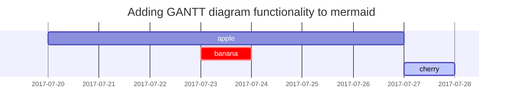

This is a test draft.

<!--more-->

And this is just the content of the test draft.

## Info alert

<i class="fas fa-info-circle" aria-hidden="true"></i> When people talk about the information "on a _CVE_", they usually mean the extended information available on the _NVD_.
{:.alert.alert-info}

## Warning alert

<i class="fas fa-exclamation-triangle" aria-hidden="true"></i> An important consideration is also how critical is the workload you are protecting in the whole scheme of your application/infrastructure. For you, **workloads exposed to the public Internet**, that **handle payments** or **sensitive private personal information**, for example, should boost the priority of the vulnerabilities found there.
{:.alert.alert-warning}

## Quote

> The mission of the _CVE Program_ is to identify, define, and catalog publicly disclosed cybersecurity vulnerabilities. There is one CVE Record for each vulnerability in the catalog. The vulnerabilities are discovered then assigned and published by organizations from around the world that have partnered with the _CVE Program_. Partners publish _CVE Records_ to communicate consistent descriptions of vulnerabilities. Information technology and cybersecurity professionals use _CVE Records_ to ensure they are discussing the same issue, and to coordinate their efforts to prioritize and address the vulnerabilities.
{:.quote}

## Image footer

{: .shadow}
_Screenshot of the MITRE ATT&CK enterprise matrix, with tactics and techniques_

## Responsive video

<div class="embed-responsive embed-responsive-16by9">
<iframe width="560" height="315" src="https://www.youtube.com/embed/Y8a5nB-vy78?start=1529" title="YouTube video player" frameborder="0" allow="accelerometer; autoplay; clipboard-write; encrypted-media; gyroscope; picture-in-picture" allowfullscreen></iframe>
</div>

## Conclusion

_The MITRE Corporation_ is an important source of diverse cybersecurity information. The _MITRE ATT&CK framework_ contains descriptions of _Tactics_, _Techniques_, and _Procedures_ that help categorize and research security threats.

If you think I should include more information on any of the _MITRE_ tools, want some advice on _cloud-native cybersecurity_, or just want to chat with me, [<i class="fab fa-twitter" style="color:#1DA1F2;" aria-hidden="true"></i> let me know](https://twitter.com/vicen_herrera){:target="_blank"}.

And if you found this information useful, let others know and [<i class="fab fa-twitter" style="color:#1DA1F2;" aria-hidden="true"></i> share it in a tweet!](https://twitter.com/share?url={{ site.url }}{{ page.url }}&title={{ page.title | url_encode }}){:target="_blank"}

## Vicente's opinion

I think they have done an excellent job.
{:.alert.alert-success.vicente-opinion}

### Task list

- [ ] TODO
- [x] Completed
- [ ] Defeat COVID-19
  - [x] Vaccine production
  - [ ] Economic recovery
  - [ ] People smile again

### Description list

Sun
: the star around which the earth orbits

Moon
: the natural satellite of the earth, visible by reflected light from the sun

## Block Quote

> This line to shows the Block Quote.

## Tables

| Company                      | Contact          | Country |
|:-----------------------------|:-----------------|--------:|
| Alfreds Futterkiste          | Maria Anders     | Germany |
| Island Trading               | Helen Bennett    | UK      |
| Magazzini Alimentari Riuniti | Giovanni Rovelli | Italy   |

## Links

<http://127.0.0.1:4000>

## Footnote

Click the hook will locate the footnote[^footnote], and here is another footnote[^fn-nth-2].

## Images

- Default (with caption)

{: width="972" height="589" }
_Full screen width and center alignment_

<br>

- Shadow

{: .shadow width="1548" height="864" style="max-width: 90%" }
_shadow effect (visible in light mode)_

<br>

- Left aligned

{: width="972" height="589" style="max-width: 70%" .normal}

<br>

- Float to left

  {: width="972" height="589" style="max-width: 200px" .left}
  "A repetitive and meaningless text is used to fill the space. A repetitive and meaningless text is used to fill the space. A repetitive and meaningless text is used to fill the space. A repetitive and meaningless text is used to fill the space. A repetitive and meaningless text is used to fill the space. A repetitive and meaningless text is used to fill the space. A repetitive and meaningless text is used to fill the space. A repetitive and meaningless text is used to fill the space. A repetitive and meaningless text is used to fill the space. A repetitive and meaningless text is used to fill the space. A repetitive and meaningless text is used to fill the space. A repetitive and meaningless text is used to fill the space."

<br>

- Float to right

  {: width="972" height="589" style="max-width: 200px" .right}
  "A repetitive and meaningless text is used to fill the space. A repetitive and meaningless text is used to fill the space. A repetitive and meaningless text is used to fill the space. A repetitive and meaningless text is used to fill the space. A repetitive and meaningless text is used to fill the space. A repetitive and meaningless text is used to fill the space. A repetitive and meaningless text is used to fill the space. A repetitive and meaningless text is used to fill the space. A repetitive and meaningless text is used to fill the space. A repetitive and meaningless text is used to fill the space. A repetitive and meaningless text is used to fill the space. A repetitive and meaningless text is used to fill the space."

<br>

## Mermaid SVG



## Mathematics

The mathematics powered by [**MathJax**](https://www.mathjax.org/):

$$ \sum_{n=1}^\infty 1/n^2 = \frac{\pi^2}{6} $$

When $a \ne 0$, there are two solutions to $ax^2 + bx + c = 0$ and they are

$$ x = {-b \pm \sqrt{b^2-4ac} \over 2a} $$

## Inline code

This is an example of `Inline Code`.

## Code block

### Common

```
This is a common code snippet, without syntax highlight and line number.
```

### Specific Languages

#### Console

```console
$ env |grep SHELL
SHELL=/usr/local/bin/bash
PYENV_SHELL=bash
```

#### Shell

```bash
if [ $? -ne 0 ]; then
    echo "The command was not successful.";
    #do the needful / exit
fi;
```

### Specific filename

```sass
@import
  "colors/light-typography",
  "colors/dark-typography"
```
{: file='_sass/jekyll-theme-chirpy.scss'}

## Reverse Footnote

[^footnote]: The footnote source
[^fn-nth-2]: The 2nd footnote source